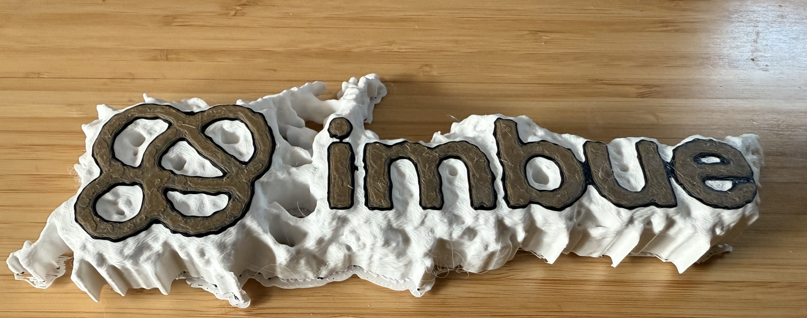
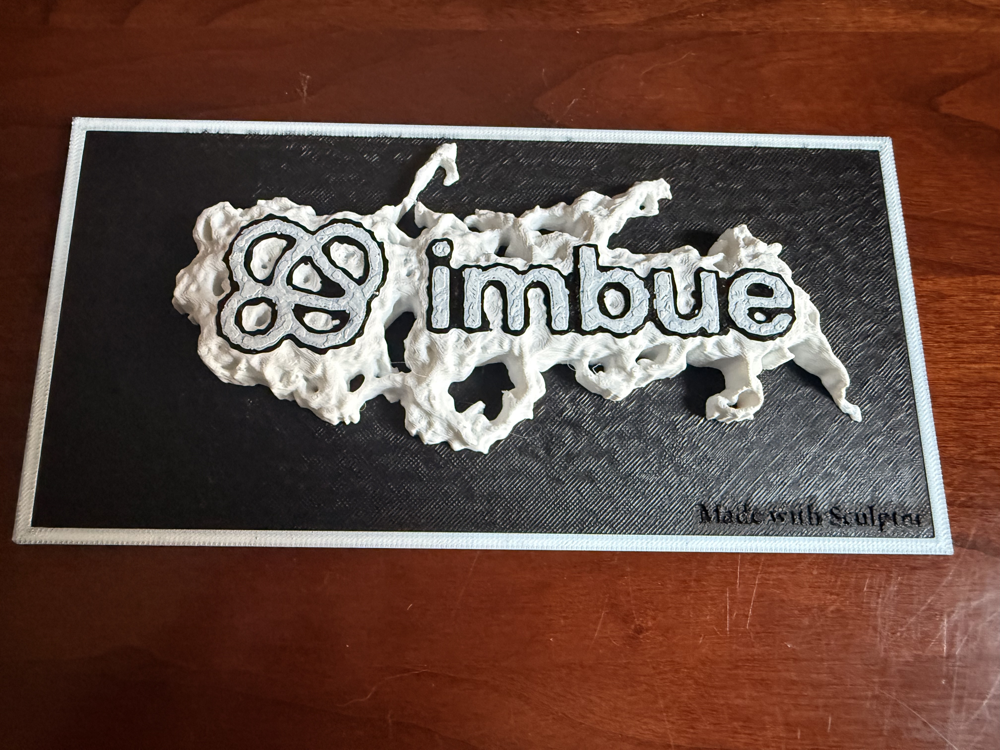
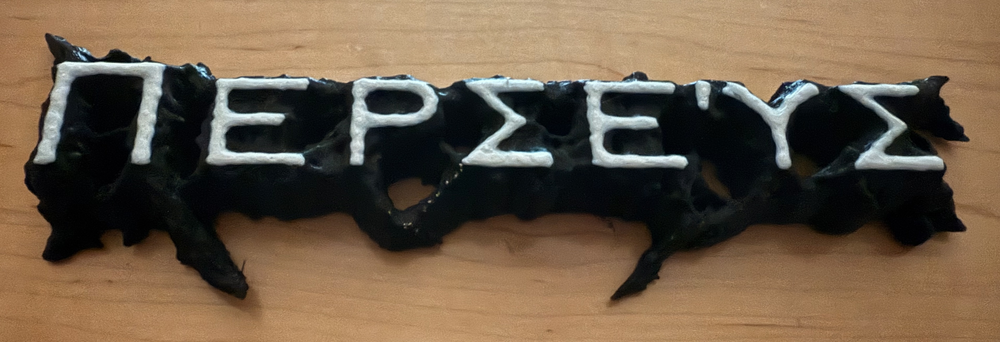
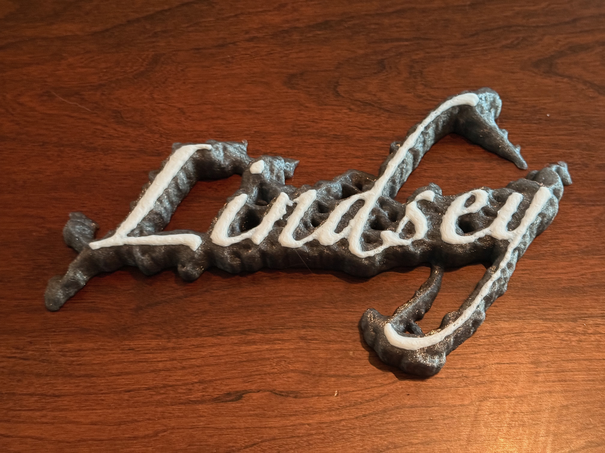
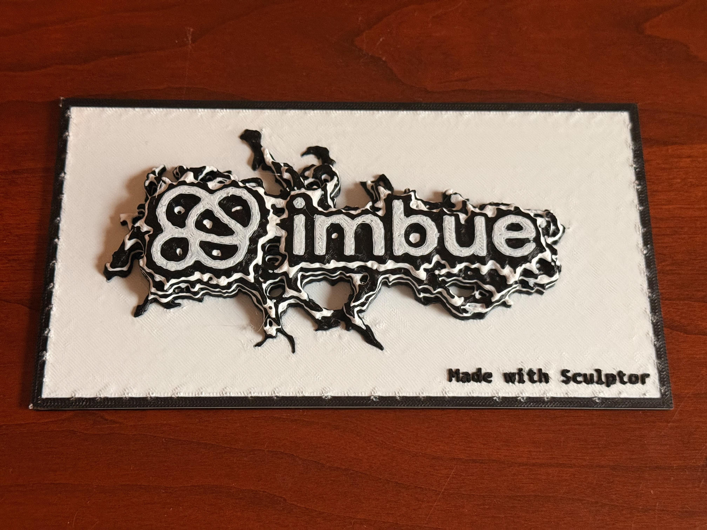

# A Sculpture made with Sculptor that makes Sculptures

I used Sculptor to create an application that creates 3D models of a very simple slime mold simulation. There’s a nice description of the algorithm on [this page](https://cargocollective.com/sagejenson/physarum).

## Links

Github repo: https://github.com/Moishe/3d-physarum

(janky) web implementation: https://3d-physarum.vercel.app/

## Process

I didn’t use much of Sculptor’s parallelism when developing this project, the basic steps I took were:

- Describe what I wanted (a command line tool that runs the slime mold simulation and creates an .STL file suitable for 3D printing) and ask it to create a [TODO file](https://github.com/Moishe/3d-physarum/blob/main/TODO.md)
- Sequentially ask it to implement sections of the TODO
- Play around with the command line utility and ask it to add features, such as:
    - better smoothing. This was a neat one because, unlike the simulation which I’m very familiar with, I didn’t have the vocabulary to describe what I wanted to implement. So at first I ended up with a “smoothed” model that looked pretty bad; the pixelation was still visible. But I was able to iterate with Sculptor/Claude and give it more details about what I actually wanted and it eventually ended up producing fairly nice results. Here’s an example of the first kind of smoothing it implemented alongside the better algorithm it got to:
        
        
        
    - Ability to specify an input bitmap to use for the original colony. This was a fun one and worked well with better smoothing. I mainly used it with text. Here’s an early print from a 3D model it generated, using different color filament at different layers (I set up the coloring manually in my printer slicing program):
        
        
        
    - After printing that out, I realized that it would be cooler if I added a background. This was partially out of laziness, because the cleaning up the jagged model was a pain (you can see the “raft” on the bottom of the model above, which I didn’t remove, because it’s a lot of work). The background makes it look way better, I think! I added the “made with sculptor” tag in the bottom right manually in the printer slicing software, like I did with the layer coloring.
        
        
        
    - Along the way I made some more enhancements, like creating a preview image (it’s not great, but it’s okay), and persisting all the parameters used to create a given model in a JSON file so it could be reproduced.
- After I got the command line program working, I thought “it would be fun if I could turn this into a web app.” I used the same approach that I did with the original program: I asked Sculptor to create a [TODO plan](https://github.com/Moishe/3d-physarum/blob/main/TODO-WEB.md), then asked it to implement the items in the TODO, sequentially. It did pretty well at this, but along the way I realized I wanted better organization of the repo — the web implementation was just directly importing files from the root of the repo, and I wanted nice pyproject.toml dependencies, so I asked Sculptor to do that via a TODO file as well, and had it follow [*that* plan](https://github.com/Moishe/3d-physarum/blob/main/TODO-RESTRUCTURE.md).
- Around this time I hit the first occurrence where Sculptor felt like it introduced more friction than using Claude directly. There was a focus issue in the React frontend, and I couldn’t do a good enough job describing the problem to Sculptor-Claude to fix it. I eventually ended up running Claude locally and going around and around to figure it out, but Claude was very good about making code changes (both isolating elements of the UI to test things, and adding logging code) and then asking me to test the changes and describe what happened. I think I *could* have done this with localsync on in Sculptor but in its state at the time it was just unreliable enough that I didn’t.
- Once I had the web application running well-enough locally, I asked Sculptor to create [a plan to deploy](https://github.com/Moishe/3d-physarum/blob/main/DEPLOY.md) it to be available on the web, and then, once again, asked it to follow the steps sequentially. I was also able to ask Sculptor to walk me through setting up accounts & projects in Vercel and Railway, which it did well.
- This led to the second case where using local Claude ended up being much more efficient than running Sculptor. Part of deploying to Railway was creating a Dockerfile, and Sculptor wasn’t able to test the file in its container, while Claude could. This let Claude iterate and debug issues much more easily than Sculptor (Claude wrote, ran and debugged tests that created the instance, launched a container pointed at that instance, and made requests against the API that the server running in the docker container exposed).

After some back and forth figuring out Dockerfile weirdness and my configuration problems with Railyard, I have a very basic and not very good application deployed on the web. It will let you create a model, with some pre-set parameters, or your own, it does the rendering on the backend, and gives you the ability to download the model and see all the models you (and whoever else used the app) created. It’s not as feature-rich as the CLI, but it *could* be, and there are lots of directions I could take it (eg. enter text, run the slime-mold simulation on the text, sell a hardcopy; a “leaderboard” of coolest simulations; upload an image and mold it & print it, etc etc etc)

## General Thoughts

This was my first time actually going all-in trying to make a moderately complex application with LLMs.

One thing that struck me is that, when I’ve written these simulations in the past, I’ve spent a lot of time developing a kind of almost tactile sense of what the simulation was *doing* and how I could modify its behavior to make it better. (some of the simulations I’ve done are on [my YouTube channel](https://www.youtube.com/@MoisheLettvin)) It struck me how far removed I was from that understanding when the LLM was writing the code — it wrote the simulation, gave me some knobs to turn, and that was pretty much it. There’s a set of things it didn’t do that I don’t think would occur to me without experience, like adding momentum to direction and speed changes, adding inherited traits to spawned actors, etc etc etc. I can’t think precisely of the things we might lose in general software engineering with this kind of distance, but I don’t think we won’t lose anything. I think it’s true that the amount of “professional” work that requires the kind of “getting ideas by doing the grungy work” is more limited than purely creative/fun coding like this, but I don’t think that amount is zero, and I think that sort of work feeding into ideas feeding into work gets more important as the work becomes more novel. (”novel” at any scale, from individual to global)

The flip side of that, though, is that leaning on LLMs to do the *boring* work meant that I actually made something — I never would’ve done this if I had to do it all by hand, the work:payoff ratio is all out of wack. Being able to ask an LLM about how & where to deploy, and assume its answers were good enough for a low stakes project, removed a barrier I frequently get stuck on. I think this project hit a sweet spot for me where there was a core thing that I’ve cared a lot about for many years, wrapped in a shell of things I know just enough about to *not* want to do them if I don’t have to. It was fun. I also had a lot of fun writing code that resulted in a real physical artifact (actually a lot of them, I need to figure out how to recycle 3D printed tchotchkes I think)

## Appendix: Some Models

The first molded-text model I made was a nameplate for my son Percy; this says “Perseus” in Greek:

I also made one for Lindsey:

And here’s my favorite Imbue nameplate:

